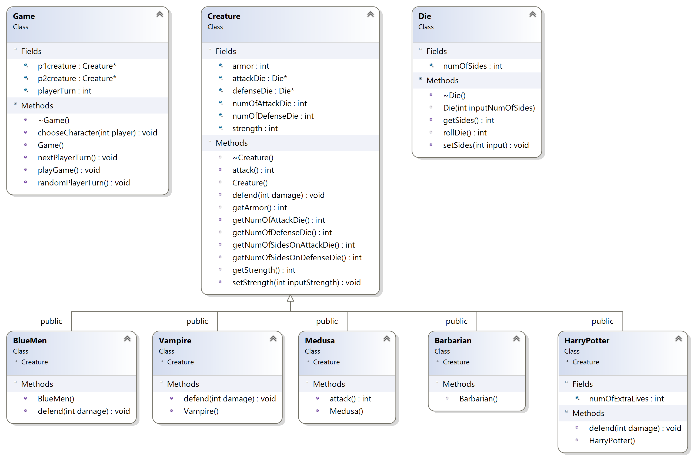
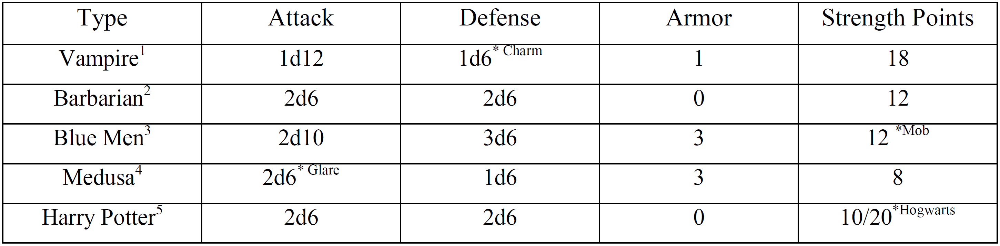

# Text-Based Fighting Simulation Game: Fantasy Combat Vol. I

Fantasy Combat Vol. I is a text-based fighting simulation game coded in C++. There are two players. Each player selects a character from an available pool to battle. The game auto-plays until one character is defeated. The battle sequence is logged to screen and the final winning player is shown.

## Instructions
1. Run `make` to compile.
2. Run `project.exe` to run game.

## Class Diagram

## Simulation Specifications
The following simulations specifications were sourced from the project assignment (Project 3, Oregon State University, CS 162 - Winter 2017).

> [The] ‘universe’ contains Vampires, Barbarians, Blue Men, Medusa and Harry Potter. Each has characteristics for attack, defense, armor, and strength points as follows.

    

&nbsp

> “3d6” is rolling three 6-sided dice, “2d10” is rolling two 10-sided dice, etc.
>
> *Charm: Vampires can charm an opponent into not attacking. For a given attack there is a 50% chance that their opponent does not actually attack them.
>
> *Glare: If a Medusa rolls a 12 in attack, then the target has looked her in the eyes and is turned to stone. The Medusa wins! If Medusa uses Glare on Harry Potter on his first life, then Harry Potter get back to life.
>
> *Mob: The Blue Men are actually a swarm of small individuals. For every 4 points of damage (round down), they lose one defense die. For example, when they reach strength of 8 they only have 2d6 for defense.
>
> *Hogwarts: If Harry dies (i.e. strength <=0), he immediately recovers and his total strength becomes 20. If he were to die again, then he’s dead.
NOTE: The sample creatures are unbalanced intentionally. This will help you in debugging your program! Some will win a lot, and others will lose a lot.
>
> To resolve an attack, you will need to generate 2 dice rolls. The attacker rolls the appropriate number and type of dice under Attack. The defender rolls the appropriate number and type of dice under Defense. You will subtract the Defense roll from the Attack roll. That is the damage to the defender.
>
> Each class only has its own information or data. When O1 is fighting O2, your program should call O1’s attack function. It will return the damage inflicted. Then O2’s defense function will take the damage inflicted, roll the specified dice and subtract the damage points from the defense. To apply the damage, you subtract the Armor value. The result is then subtracted from the
Strength Points. That value becomes the new Strength Points for the next round. If Strength Points goes to 0 or less, then the character is out of the combat.
>
> For example, if one object receives 9 points of damage and rolls 3 for its defense, and has an armor of 4 and strength point of 8, it would take 9 subtract 3, and then 4 for the armor, to receive 2 points of damage, and its
new strength point will be 8-2=6.

